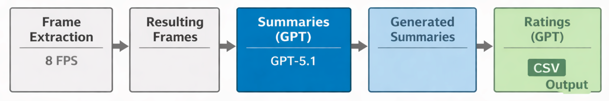

# GPT_UX_Ratings

<p align="center"> A pipeline for generating synthetic UX ratings for autonomous-vehicle traffic scenarios using GPT-5.1 </p> <p align="center">     </p>

<p align="center">
  
</p>

## Table of Contents
1. [Introduction](#introduction)
2. [Report](#report)
   1. [Motivation](#motivation)
   2. [Process](#process)
   3. [Results](#process)
   4. [Conclusion & Outline](#conclusion-&-outline)
3. [Pipeline](#pipeline)
   1. [Features](#features)
   2. [Project Structure](#project-structure)
   3. [Setup Instructions](#setup-instructions)
      1. [Clone the Repository](#clone-the-repository)
      2. [Configuration](#configuration)
4. [Usage](#usage)
5. [Questionnaire Sources](#questionnaire-sources)
6. [Troubleshooting](#troubleshooting)
7. [License](#license)
8. [References](#references)


## 1. Introduction

**GPT UX Ratings** is designed to evaluate how different traffic situations may be perceived by passengers in autonomous vehicles. The system uses OpenAI's GPT model to simulate answers to established UX rating questions.

This method helps generate synthetic datasets for traffic safety, automation research, and behavioral studies involving passenger perceptions.

## 2.  Report

### 1. Motivation 
Automated vehicles will increasingly need to understand how their drivers experience different traffic situations in order to support them appropriately. Today, assessing **mental workload, trust, or perceived safety** still relies on intrusive sensors, controlled lab environments, or frequent self reports (Diarra et al., 2025). These methods produce valuable data, but they do not scale to everyday driving or cannot provide continuous feedback without interrupting the user.

This project explores a different approach: instead of measuring the driver directly, it focuses on what can be **inferred from the scene itself.** The pipeline takes driving videos, uses OpenAI models to generate structured descriptions of what is happening, and then uses these descriptions to simulate how people might respond on established questionnaires that capture workload, trust, and situational awareness. This concept builds on the recently developed idea of using LLMs to simulate individual users and act as them in order to generate plausible ratings (Yu et al., 2025). In another example, You et al. (2025) developed an LLM-powered framework that generates assessments on safety, intelligence, and comfort in order to evaluate driving performance. In another relevant development, surveys highlight how foundation models can produce semantically rich scene descriptions, perform risk assessment, and generate scenario evaluations from driving videos and sensors alone (Gao et al., 2025).

The present work attempts a much simpler approach and examines whether commercial, general large language models have enough scene understanding and contextual reasoning to approximate such subjective ratings from real-life driving videos.

### 2. Process 

#### First steps and general idea

- **Video collection:**  
  Driving-scene videos were collected from YouTube due to its accessibility and the availability of a wide range of real-world driving footage. A systematic search strategy was employed using keywords related to driving incidents and conditions (e.g., near-miss, traffic accident, dashcam, rain driving, fog, urban roads, highways). The search focused on capturing diverse real-world scenarios, including near-accidents, varying weather conditions, and different road environments. Approximately 100 videos were initially selected to allow for exclusions during preprocessing, such as poor video quality, irrelevant content, or technical incompatibilities. This approach ensured sufficient variability in the dataset while maintaining flexibility for data filtering and quality control.

- **Field-of-view cropping:**  
  Each video was cropped to display only the **forward windshield view**, removing irrelevant elements outside the driver’s visual field.

- **Duration trimming:**  
  Videos were clipped to a standardized length between **7 and 30 seconds** to ensure consistency across the dataset.

- **Quality filtering:**  
  The initial set of 89 videos was reduced after discarding clips that did not meet the required quality or content criteria.

- **Pipeline construction:**  
At first the idea was to send the **full video clip** to get ratings for simulated participants, but we looked into how **video processing** is done through chatgpt and since it only considers a **certain number of frames**, in order to have more control over the what frames were taken into account we decided to **extract frames as a separate process** and then send them to the model. However, the model has an **upper limit for images** that can be sent in one prompt, that is not compatible with the **amount of detail** that is needed to analyze **multi-second video**. We started with **4 frames per second** but increased this to **8 frames per second** in order to try and enhance the **qualities of the summaries.** This is why we decided to first use the model to **generate summaries for subsequent batches** and **combine them to keep a coherent story** of whats going on in the driving scene and to send that to the model to obtain the ratings.


**Prompt Development**

The initial prompt was designed with only the **basic information** thought necessary to generate scene summaries. However, through **trial and error**, we iteratively refined the prompt to improve the **accuracy, clarity, and relevance** of the summaries. This process ensured that the GPT-based model produced outputs better aligned with the events depicted in the driving videos.

This was an earlier version: 

_Generate a summary for the following frames extracted from a driving video at the rate of one frame every quarter second. 
You are seeing the view through a windshield of an automated vehicle. 
Build on the previous summary without repeating what was already established unless it is necessary for continuity. Focus on new or changing details — moving objects, traffic signals, pedestrians, and notable events.
Keep the style factual and objective, avoiding poetic or overly descriptive language.
Use 1–2 clear sentences per update, enough to capture what is happening without overexplaining. If nothing significant changes, summarize that briefly in one short sentence. Respond only with the update. Here is the summary so far: {summary_so_far}_


It was then iteratively updated: 

_Generate a summary for the following frames extracted from a driving video at the rate of eight frames per second. **They are labeled in order with a number in the top left corner.** You are seeing the view through a windshield of an automated vehicle. Build on the provided summary of previous             frames without repeating what was already established unless it is necessary for continuity. Focus on new, unexpected, or changing details — moving objects, traffic signals, pedestrians, and notable events. **Ignore any subtitles or encoded time or speed information but consider that every frame you       see is 1/8 of a second apart.**
Keep the style factual and objective, avoid poetic or overly descriptive language.
Use 1–2 clear sentences per update, enough to capture what is happening without overexplaining. **If what you see adds information to or contradicts something previously stated in the summary, point it out.** Respond only with the update. Here is the summary so far: {summary_so_far}_

These changes were made to solve the following issues: 
- some summaries raised suspicions that the **frames within a batch were not procressed in the correct order**
- some video clips included the **car's speed** or **subtitles of passengers' speech** which were mentioned in the summaries
- we hoped that by putting emphasis on the **framerate** the summaries would more accurately reflect the **speed of things happening in the scene**
- we wanted the summaries to be **more coherent** and for the model to able to **integrate new information with the previously seen frames**

Sentence-by-sentence rationale

**“Generate a summary for the following frames extracted from a driving video at the rate of eight frames per second.”**  
This establishes that the input consists of **discrete frames rather than continuous video** and explicitly communicates the **temporal sampling rate**. Without this, the model often assumes a slower or irregular frame cadence, leading to incorrect inferences about speed, urgency, or event duration.

---

**“You are seeing the view through a windshield of an automated vehicle.”**  
This sentence serves two purposes:

1. **Perspective grounding:**  
   It constrains the viewpoint to a forward-facing, driver-like perspective, discouraging interpretations as CCTV footage, dashcam commentary, or third-person observation.

2. **Removal of human-driver assumptions:**  
   Explicitly stating that the vehicle is *automated* prevents the model from attributing intent, attention, hesitation, or corrective actions to a human driver (e.g., “the driver decides to slow down”).  
   This is essential because later stages interpret the scene **from a passenger’s perspective**, where control is delegated to the system rather than a human.

---

**“Build on the provided summary of previous frames without repeating what was already established unless it is necessary for continuity.”**  
This instruction enforces **incremental summarization**. Since frames are processed in batches, repetition would:
- inflate summaries unnecessarily,
- obscure temporal structure,
- and increase the chance of contradictions.

Allowing repetition *only when needed* preserves coherence across batches without restating static context (e.g., weather, road type).

---

**“Focus on new, unexpected, or changing details — moving objects, traffic signals, pedestrians, and notable events.”**  
This narrows attention to **dynamic and safety-relevant elements**. Without this constraint, the model frequently over-describes static background details (buildings, trees) at the expense of evolving interactions.

The explicit examples anchor the model to **traffic-relevant semantics** rather than generic visual description.

---

**“Ignore any subtitles or encoded time or speed information but consider that every frame you see is 1/8 of a second apart.”**  
Many videos contain overlays (speed readouts, timestamps, passenger speech subtitles). This instruction:
- prevents leakage of **non-visual metadata** into the summary,
- ensures that inferred speed or urgency is based on **visual change over time**, not on textual overlays.

Reiterating the frame interval reinforces temporal reasoning without introducing absolute time cues.

---

**“Keep the style factual and objective, avoid poetic or overly descriptive language.”**  
This constrains the output to an **analytic register**. Subjective or narrative phrasing (e.g., “a terrifying moment unfolds”) would bias downstream UX ratings and introduce emotional framing that is not grounded in the visual input.

---

**“Use 1–2 clear sentences per update, enough to capture what is happening without overexplaining.”**  
This enforces **brevity and consistency** across batches. Longer outputs tended to:
- speculate beyond the available evidence,
- reintroduce previously stated context,
- or drift into interpretation rather than description.

---

**“If what you see adds information to or contradicts something previously stated in the summary, point it out.”**  
This sentence was added after observing that early misinterpretations (e.g., assuming a vehicle had stopped safely) were **never corrected**, even when later frames contradicted them.  
The instruction explicitly allows the model to **revise earlier statements**, which is essential for any form of temporal integration.

---

**“Respond only with the update.”**  
This prevents meta-commentary, explanations, or formatting artifacts. Clean, minimal output is required because summaries are **directly concatenated** and later reused as model input for rating generation.


#### Project Timeline (after video collection)

- Initial research : Identified potential issues: sent videos are analyzed based on few frames, number of images that can be sent is limited
- Pipeline construction : Built the pipeline with intermittent tests: first the frame extraction, then the summary generation, then the rating generation (initially for only one simulated participant)
- Planning to test the pipeline : Start with 10 participants (balanced gender, ages relative to US population distribution) and scale up if the pipeline works
- Pipeline adjustment : Included participant generation according to the criteria
- First test run of the pipeline excluding the rating generation : Summaries [[Link to summary 1]](materials/summaries/sept17_1_clip8.md), [[Summary 2]](materials/summaries/sept17_3_clip1.md) failed to detect key events of videos [[Video 1]](materials/videos/1_clip8.mp4), [[Video 2]](materials/videos/3_clip1.mp4) (crash, fire)
- Investigating causes : Confirmed that frames were sent correctly; manual test in ChatGPT UI produced better results
- Changed model : Model switched from GPT-5-nano to GPT-5, initial impression that summary quality improved - videos [[Video 1]](materials/videos/1_clip8.mp4), [[Video 3]](materials/videos/1_clip5.mp4), summaries [[Summary 1.2 (corresponding to video 1)]](materials/summaries/oct8_1_clip8.md), [[Summary 3]](materials/summaries/oct8_1_clip5.md) (however, the time required to generate one summary increased significantly)
- Issue : Crash detected inconsistently across runs despite identical prompts
- Discussion : Suggestion to add a step to re-check the description and video frames after generation to detect overarching events, rejected due to the same issue of only being able to consider a small number of frames at a time. However, we experimentally gave some of the later generated summaries to ChatGPT (without frames) with the prompt "What do you think happemed here?". The results reflected the quality of the summaries themselves - if an event was not mentioned or hinted at in the summary, ChatGPT did not deduce that it might have occurred.
- Change to the prompt : Instruct the model to correct earlier statements when information from new frames contradicts or refines them
- Result : Crash description improved ("camera jolts… likely contact") [[Summary 1.3]](materials/summaries/oct28_1_clip8.md), but still inconsistent across runs
- Further changes to pipeline and prompt : Frame extraction increased to 8 FPS; added requirement for explanations in rating generation
- Observation : Even with more frames, the test still failed to mention the crash reliably
- Testing the rating generation with summary 1.3: Synthetic rating generation with 24 generated participants (equal age groups and number of participants per age bracket instead of the distribution for analysis purposes)
- Rating results : One participant returned invalid rating values; several justifications did not match events: The summary "The white van continues its left turn into our lane; we brake hard and the camera jolts and tilts, indicating an abrupt stop and likely contact with the van" lead to many justifications showing the assumption that a crash was avoided, for example: "The system was effective in slowing and avoiding collision"
- Conclusion regarding ratings : Future implementations will need a post-processing validation step to catch out-of-range values and then regenerate faulty entries. Considering that the ratings won't be of use as long as the summaries are not accurate, this is out of scope for the present project.
- Further notes on the ratings : LLMs often produce unrealistically low standard deviations, literature (e.g., Anthis et al., 2025) showed that alternative methods perform worse (prompting the generation of a distribution across a group rather than values for individual participants) or are unsupported (temperature scaling). Thus, out pipeline will continue to use the method of giving the LLM participant profiles (age, gender)
- Discussion : Are the three videos we chose for testing uniquely difficult?
- Model change : Model switched from GPT-5 to GPT-5.1, which had just come out, to test whether the newer model would yield consistent and accurate summaries.
- Full investigation of summary generation for the collected video clips : We generated summaries for all videos of our dataset and watched the videos ourselves in order to judge the accuracy of the summaries. In the process, we decided to remove 8 of the clips for being too long (and thus generating very long summaries) or due to quality issues, leaving us with 81 video clips. [[File 1]](materials/videos_spreadsheet.pdf) includes the obtained summaries, as well as a color coded rating (red = crucial/defining information missing, yellow = important information missed, green = accurate description) and a short explanation of our choice. 36 of the summaries received a red rating, 17 a yellow rating, and 24 a green rating. However, most of the green rated summaries were of videos that did not include any notable events beyond adverse weather conditions.
- Final conclusion : Due to this insight, we concluded that it is not currently feasible to reliably obtain acceptable summaries, and thus ratings, of videos depicting a varied set of traffic situations, in particular ones showing unusual or dangerous events.

### 3. Results
> **Summary of empirical observations from the generated scene summaries and synthetic UX ratings**
- **Locally accurate, globally fragile scene understanding**  
  The model reliably identifies visible objects, lanes, weather conditions, and short-term maneuvers, but often fails to reconstruct **multi-frame, safety-critical events** such as crashes, near-misses, or complex interactions unfolding over time.
- **Temporal omissions propagate downstream**  
  When an early or defining event is missed in the summary, it is rarely recovered later. These omissions directly shape subsequent interpretations and cannot be corrected during rating generation.
- **High failure rate for complex or unusual scenarios**  
  In a manual review of 81 video clips, fewer than one-third of summaries were rated as fully accurate. Most accurate summaries corresponded to **low-complexity scenes** without abrupt hazards or rare events.
- **Lane structure and spatial relations are frequent error sources**  
  Lane boundaries, merge directions, and vehicle positions relative to lanes are commonly misinterpreted, even when other scene elements are correctly identified.
- **Justifications expose implicit assumptions**  
  Textual explanations sometimes contradict video reality (e.g., “collision avoided”) when the summary does not explicitly state otherwise, indicating that the model fills gaps using default expectations or misses the event completely.
- **Post-processing and validation are necessary**  
  Out-of-range values, semantic mismatches, and overconfident interpretations occur sporadically, highlighting the need for automated checks before synthetic ratings can be used for analysis.


### 4. Conclusion & Outlook
The project shows that, in its current form, **GPT-5.1** is not yet reliable enough to generate meaningful **synthetic UX ratings** for **complex driving scenarios.** While the model was able to recognize many scene elements and maintain a degree of narrative continuity, it frequently **overlooked or misinterpreted safety-critical details.** This resulted in summaries that were sometimes coherent at the micro-level but incomplete at the event-level, especially in situations involving **multi-frame dynamics** such as near-misses, abrupt maneuvers, or collisions. Another frequently occurring issue was that **lane boundaries were interpreted incorrectly.** Small details that were irrelevant to the evolving situation were often described in detail, showing that although the model is capable of identifying components of the scene relatively reliably, their relevance and interaction are not captured.

Even with careful prompt engineering, higher frame rates, and explicit instructions to correct earlier statements, the model struggled with **temporal reasoning.** When relevant cues unfolded across several frames, **early omissions propagated** throughout the summary, preventing the model from reconstructing the full situation. This directly affected the subsequent rating generation: the synthetic participants often failed to map the scenario to appropriate **UX constructs** (e.g., **perceived safety, predictability, mental workload**), occasionally assuming that no crash or dangerous event occurred despite clear visual evidence.

The ratings themselves further highlighted these limitations. Several responses contained **out-of-range values, mismatches** between justifications and events, or **unrealistically low standard deviations**—a well-known issue in LLM-based social simulations. At times, the outputs did not conform to the intended questionnaire scales at all. These issues demonstrate that, without additional constraints, LLMs tend to produce overly consistent, insufficiently varied, and sometimes **semantically misaligned synthetic data.**

Overall, the findings emphasize the need for **systematic post-processing, quality validation,** and more **robust prompting structures** when attempting to use LLMs as proxies for human UX ratings in dynamic, real-world environments. While the model shows promise in basic scene description, it currently lacks the **temporal precision** and **psychological grounding** required to generate trustworthy UX assessments for automated driving research.

In the future, this pipeline could be tested with other models better suited for vision and scene description. For example, a **Llava model** could be used and the **API key** will need to be changed in the .env file and the [**API function call**](ratings#L193) in the ratings script will need to be updated. Such models may offer stronger temporal coherence, improved detection of events, and more reliable interpretation of subtle scene cues. It would be possible to determine whether these variations result in more reliable summaries and more significant UX scores by evaluating them inside the same pipeline.  

Once alternative vision models are integrated, if the summaries are deemed accurate, it becomes essential to validate the resulting rating by comparing the **synthetic ratings** to **real human responses**, to ensure that improvements in scene understanding translate into meaningful UX assessments. **Benchmarking** the model's assessments against real human data is the next step to determine where the model differs the most. These contrasts may show whether the LLM tends to misinterpret events. By systematically comparing synthetic ratings across demographic groups or driving experiences and assessing whether these patterns correspond with known findings, potential **biases** can be identified.


## 3. Pipeline 
### 1. Features 
This project uses **OpenAI’s GPT-5** model to analyze frames extracted from driving videos and simulate human emotional reactions (as CSV ratings) for different age groups and gender.

It automates the following:
1. Extracts frames every **⅛ second** from each video.
2. Sends the frames in batches of 10 in  **GPT-5** API.
3. Prompts the model to generate a summary of the videos events  
4. Prompts the model to generate a participant rating of the situations based on the summaries 
5. Saves all responses as **CSV files**.


### 2. Project Structure

```plaintext

GPT_UX_ratings/
│
├── README.md
├── requirements.txt
├── .gitignore
├── frames_summaries.py
├── ratings.py
│
├── materials/                       
|   ├── example_ratings/
│   ├── example_summaries/
│   ├── example_videos/
│   ├── timeline.svg
│   └── videos_spreadsheet.pdf

```


## 4. Usage

### 1. Setup Instructions

#### 1. Clone the Repository
Clone the repository and install dependencies:

```bash
git clone https://github.com/arcymonka/GPT_UX_ratings.git
cd GPT_UX_ratings
pip install -r requirements.txt
```
#### 2. Set up .env file

Create a `.env` file in the root directory to configure the following environment variables:

```ini
OPENAI_API_KEY="your_openai_key"
VIDEO_PATH="path/to/videos"
OUTPUT_PATH="path/to/frames"
SUMMARY_PATH="path/to/summaries"
RATINGS_OUTPUT_PATH="path/to/output/ratings"
RANDOM_SEED=42
```


Ensure all referenced directories exist and contain valid data files (e.g., `.txt` summaries in `SUMMARY_PATH`).

### 2. Running the scripts
Run the scripts in the following order: 
```bash 
python frames_summaries.py
python ratings.py
```


`frames_summaries.py` will:
- Load videos from the configured `VIDEO_PATH`
- Save the frames in per-video subfolders in `OUTPUT_PATH`
- Load image frames from `OUTPUT_PATH`  
- Process the frames using the OpenAI API saved in `OPENAI_PATH`.
- Save one summary per video in the `SUMMARY_PATH` directory.

`ratings.py` will:
- Read each summary file from `SUMMARY_PATH`
- Generate a prompt for each age/gender combination
- Call OpenAI's API to simulate ratings
- Save each response to a CSV in `RATINGS_OUTPUT_PATH`

## 6. Using another LLM
The pipeline is model-agnostic by design and can be adapted to use other large language or vision–language models for both scene summarization and rating generation. This is particularly relevant given the limitations observed with GPT-5.1 in handling multi-frame, safety-critical events. The change requires explicit code changes in two places. Right now, model usage is hard-coded in the scripts (not configurable via `.env` beyond the OpenAI API key).

There are **two independent integration points**:

1. **Frame → scene summary generation** (`frames_summaries.py`, vision-capable model)
2. **Scene summary → UX rating generation** (`ratings.py`, text-only model)

These stages can use **different models**.

### 6.1 Replace the scene summarization model (vision-capable)
Scene summaries are generated in `frames_summaries.py` inside:

- `process_frames_with_openai(frames, summary_so_far)`

This function:
- sends **batches of 10 frames** (`chunk = frame_paths[i:i+10]`)
- encodes each frame as a `data:image/jpeg;base64,...` payload
- prepends the prompt from `build_prompt(summary_so_far)`
- expects a **plain-text** update to append to the running `summary`

Current OpenAI call:

```
resp = client.chat.completions.create(
    model="gpt-5.1",
    messages=[
        {
            "role": "user",
            "content": [
                {"type": "text", "text": build_prompt(summary_so_far)},
                *images_payload,
            ],
        }
    ],
)
```
**To use another vision–language model

Replace the OpenAI client call inside `process_frames_with_openai(...)` with your provider’s API call. The replacement must:

- accept multiple images per request (10 images per chunk)

- preserve image order (frames are time-ordered by filename)

- support interleaved text + images (prompt + image payload)

- return only raw text (no markdown, no extra commentary)

Important: The summarization prompt is tightly coupled to the pipeline. For benchmarking, keep `build_prompt(...)` unchanged when swapping models.

### 6.2 Replace the rating-generation model (text-only)

Synthetic UX ratings are generated in `ratings.py` inside `process_summary_with_openai(summary_text, age, gender)`

This stage:

- receives only the summary text

- requests numeric-only output in a CSV row (30 values)

- post-processes responses via sanitize_csv_row() to enforce column count

Current OpenAI call:

```
resp = client.chat.completions.create(
    model="gpt-5-nano",
    messages=[{"role": "user", "content": prompt}],
)
raw = resp.choices[0].message.content.strip()
return sanitize_csv_row(raw, expected_cols=30)
```

**To use another text LLM

Replace the model call inside `process_summary_with_openai(...)` with your provider’s API call. The replacement should:

- follow strict formatting instructions (numbers only)

- avoid adding explanations or headers

- produce stable numeric outputs under identical prompts

If the model sometimes returns extra text, `sanitize_csv_row()` will attempt to recover numbers, but frequent recovery usually indicates the model is not suitable for this stage.

### 6.3 Environment variables and keys
Currently, `.env` configures only the OpenAI API key for both scripts:
```
OPENAI_API_KEY="your_openai_key"
```
If you switch to another provider, you must:

- replace the OpenAI client initialization in both scripts

- handle authentication for the new provider (API key, base URL, etc.)

No provider abstraction layer is implemented yet.

### 6.4 Constraints imposed by the current design

Any alternative model must work within these constraints:

- Summaries are generated from 10-frame batches (chunked inference)

- Frames are extracted at 8 FPS (125 ms step), and the prompt assumes this timing

- Summaries are incremental: each chunk builds on `summary_so_far`

- The model never sees the full clip at once (no global second pass)

Some failure modes (e.g., missed crashes) can stem from these structural constraints, not just model quality.

## 5. Questionnaire Sources

The 30-item rating scale is built upon validated measures from several academic sources:

- **Perceived Safety** – Faas et al. (2020)
- **Trust in Automation** – Körber (2019)
- **Predictability** – Körber (2019)
- **Acceptance** – Van der Laan et al. (1997)
- **SART (Situation Awareness Rating Technique)** – Taylor (2017)

## 6. Troubleshooting

| Issue                             | Possible Cause                                | Solution                                   |
|----------------------------------|-----------------------------------------------|--------------------------------------------|
| No CSV output                    | API key issue or missing input files          | Check `.env` values and summary folder     |
| Ratings are misformatted         | Unexpected model output                       | Review prompt and ensure GPT model validity|
| API error or rate limit exceeded | Too many requests or invalid model version    | Try again later or adjust request volume or add money to API account |
| Output folder not created        | Missing permissions or invalid path           | Ensure script can create/write to paths    |

## 7. License

This project is licensed under the MIT License. See the [LICENSE](LICENSE) file for details.

## 8. References 

Anthis, J. R., Liu, R., Richardson, S. M., Kozlowski, A. C., Koch, B., Brynjolfsson, E., Evans, J., & Bernstein, M. S. (2025). LLM social simulations are a promising research method (arXiv preprint arXiv:2504.02234 v2). arXiv. https://doi.org/10.48550/arXiv.2504.02234

Diarra, M., Theurel, J., & Paty, B. (2025). Systematic review of neurophysiological assessment techniques and metrics for mental workload evaluation in real‑world contexts. Frontiers in Neuroergonomics.

Faas, S. M., Mattes, S., Kao, A. C., & Baumann, M. (2020). Efficient paradigm to measure street-crossing onset time of pedestrians in video-based interactions with vehicles. Information, 11(7), 360. https://doi.org/10.3390/info11070360

Gao, H., Xu, T., Xu, Y., Wang, Z., & Zhang, J. (2025). Foundation models in autonomous driving: A survey on scenario generation and analysis. arXiv. https://arxiv.org/abs/2506.11526

Körber, M. (2019). Theoretical considerations and development of a questionnaire to measure trust in automation. In S. Bagnara, R. Tartaglia, S. Albolino, T. Alexander, & Y. Fujita (Eds.), Proceedings of the 20th Congress of the International Ergonomics Association (IEA 2018) (Advances in Intelligent Systems and Computing, Vol. 823, pp. 13-30). Springer. https://doi.org/10.1007/978-3-319-96074-6_2

Taylor, R. M. (2017). Situational Awareness Rating Technique (SART): The Development of a Tool for Aircrew Systems Design. In Situational Awareness (pp. 111–128). Routledge. https://doi.org/10.4324/9781315087924-8

Van Der Laan, J. D., Heino, A., & De Waard, D. (1997). A simple procedure for the assessment of acceptance of advanced transport telematics. Transportation Research Part C: Emerging Technologies, 5(1), 1–10. https://doi.org/10.1016/S0968-090X(96)00025-3

You, S., Luo, X., Liang, X., Yu, J., Zheng, C., & Gong, J. (2025). A comprehensive LLM‑powered framework for driving intelligence evaluation. arXiv. Advance online publication.
https://arxiv.org/abs/2503.05164

Yu, Z., Zhou, Y., Zhao, C., & Wen, H. (2025). An Analysis of Large Language Models for Simulating User Responses in Surveys
